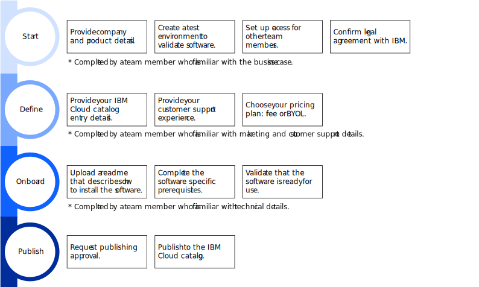

---

copyright:

  years: 2020, 2021

lastupdated: "2021-04-01"

keywords: end-to-end, software onboarding, checklist, third party, requirements, sellers, partner portal, partners, third-party software, partner center

subcollection: third-party

---

{:right: .ph data-hd-position='right'}
{:shortdesc: .shortdesc}
{:table: .aria-labeledby="caption"}
{:codeblock: .codeblock}
{:screen: .screen}
{:tip: .tip}
{:note: .note}
{:beta: .beta}
{:term: .term}
{:external: target="_blank" .external}

# Checklist for selling software on {{site.data.keyword.cloud_notm}}
{: #checklist-software}

Use the following checklist to track all the tasks that are required to successfully onboard and sell your third-party software on {{site.data.keyword.cloud}}.
{:shortdesc}

The process to sell third-party software is available solely for providers that understand the onboarding process is still under development. With the current release, you can bring your own licenses or deliver your third-party software for free. If you’re interested in trying it out, contact us at kdmeyer@ibm.com.
{: beta}

## Before you begin
{: #sw-software-type}

Review the list of supported software:

* Helm charts
* Terraform templates
* OVA images
* Operators

## Workflow for selling software on {{site.data.keyword.cloud_notm}}
{: #sw-workflow-image}

The following diagram summarizes the process of onboarding software to the {{site.data.keyword.cloud_notm}} catalog. For details about each task, see the sections that follow.

{: caption="Figure 1. The workflow for onboarding software on to the IBM Cloud catalog" caption-side="bottom"}

## Complete the getting started tasks
{: #sw-start-checklist}

The following tasks are typically completed by a team member who is familiar with the business case for the product. 

| Task | Description | Environment |
|------|-------------|-------------|
| <input type="checkbox" disabled /> Provide your company and product details | Specify the names of your company and product.  | {{site.data.keyword.cloud_notm}} console | 
| <input type="checkbox" disabled /> Create a test environment | The test environment is used to onboard your software and validate it's ready for use. | {{site.data.keyword.cloud_notm}} console |
| <input type="checkbox" disabled /> Assign team access | With the correct {{site.data.keyword.cloud_notm}} Identity and Access Management (IAM) access, members of your team can help onboard your software. | {{site.data.keyword.cloud_notm}} console |
| <input type="checkbox" disabled /> Invite team members to your account | Members of your account are assigned the IAM access that you set up in the previous task.  | {{site.data.keyword.cloud_notm}} console |
| <input type="checkbox" disabled /> Review and sign the {{site.data.keyword.IBM}} Digital Provider Agreement | Indicate that you understand the terms and signed the agreement between you and {{site.data.keyword.IBM_notm}}. | {{site.data.keyword.cloud_notm}} console |
{: caption="Table 1. Getting started tasks for selling software" caption-side="top"} 

For more information, see [Getting set up to sell software](/docs/third-party?topic=third-party-sw-getting-started). 

## Tell us about your product 
{: #sw-details-checklist}

The following tasks are typically completed by a team member familiar with the business case, marketing details, and customer support experience for the product. 

| Task | Description | Environment |
|------|-------------|-------------|
| <input type="checkbox" disabled /> Verify your partner details | Review the partner and product information that you provided as part of the getting started tasks to make sure that everything is correct. | {{site.data.keyword.cloud_notm}} console |
| <input type="checkbox" disabled /> Define your catalog entry | Add your product logo, description, and other details for your software's entry in the {{site.data.keyword.cloud}} catalog. | {{site.data.keyword.cloud_notm}} console |
| <input type="checkbox" disabled /> Define your customer support experience | Provide details about how users can get help with using your software.  | {{site.data.keyword.cloud_notm}} console |
{: caption="Table 2. Tasks for defining software details" caption-side="top"} 

For more information, see the following links:

* [Defining your catalog entry](/docs/third-party?topic=third-party-sw-catalog-details)
* [Defining your customer support experience](/docs/third-party?topic=third-party-sw-support-details)

## Onboard your product
{: #sw-validate-checklist}

The following tasks are typically completed by a technical member of your team. 

| Task | Description | Environment |
|------|-------------|-------------|
| <input type="checkbox" disabled /> Set up your source code repository | Create a release in your source code repository to deliver and manage versions of your software. | Your GitHub repository |
| <input type="checkbox" disabled /> Upload a readme file | Provide a readme file that describes how users can install your software and get customer support. | Your GitHub repository |
| <input type="checkbox" disabled /> Onboard your software| Import a version, configure the deployment details, set any license requirements, and validate that the version can be successfully installed on the infrastructure that you require. | {{site.data.keyword.cloud_notm}} console |
{: caption="Table 3. Tasks for onboarding software" caption-side="top"} 

For more information, see the following links:

* [Setting up your source code repository](/docs/third-party?topic=third-party-source-repo-setup)
* [Onboarding your software](/docs/third-party?topic=third-party-sw-validate)

## Publish your product
{: #sw-publish-checklist}

The following tasks are completed by any member of your team. 

| Task | Description | Environment |
|------|-------------|-------------|
| <input type="checkbox" disabled /> Verify that all tasks are completed | Confirm that you completed the getting started tasks, defined your software details, and onboarded your software. | {{site.data.keyword.cloud_notm}} console |
| <input type="checkbox" disabled /> Request to publish your software | Submit a request for {{site.data.keyword.cloud_notm}} to review your product details and approve it's ready for publishing. | {{site.data.keyword.cloud_notm}} console |
| <input type="checkbox" disabled /> Publish your software | After your publishing request is approved, publish your software to the {{site.data.keyword.cloud_notm}} catalog. | {{site.data.keyword.cloud_notm}} console |
{: caption="Table 4. Tasks for publishing software" caption-side="top"} 

For more information, see [Publishing your software to the {{site.data.keyword.cloud_notm}} catalog](/docs/third-party?topic=third-party-sw-publish).

As a third-party provider, you're responsible for maintaining all assets of published software in the {{site.data.keyword.cloud}} catalog and deprecating outdated versions.  
{: note}
